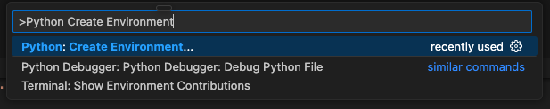

# Query Answering System
A conversational AI system that takes user queries, refines them, retrieves relevant documents, and generates answers using NLP techniques and LangChain framework.

## Table of Contents
1. [Introduction](#introduction)
2. [Installation](#installation)
3. [Usage](#usage)
4. [System Overview](#system-overview)
5. [Example Use Cases](#example-use-cases)

## Introduction
The Query Answering System is designed to provide accurate and relevant responses to user queries. It leverages the power of natural language processing (NLP) techniques and the LangChain framework to refine queries, retrieve relevant documents, and generate answers.

## Installation
To install the required dependencies, follow these steps:

1. **Install Ollama**: First, ensure that you have [Ollama](https://ollama.com/) installed on your system.
2. **Pull LLaMA Model**: Run `ollama pull llama3.1:8b` to download the required LLaMA model.
3. **Run the Downloaded Model** Run `ollama run llama3.1:8b` to run the downloaded LLaMA model.
4. <a href="Creating%20environments" style="font-weight: bold;">Create and activate a Python Environment</a>
   1. Open command palette \
   
   2. Search and select `Python: create environment`\
   
   3. Choose `venv` \
   
   4. Choose interpreter path \
   
   5. Select `requirements.txt` and click OK \
   

## Usage
To use the question answering system, simply run the main script and follow the prompts.

1. **Run the Downloaded Model** Run `ollama run llama3.1:8b` to run the downloaded LLaMA model.
2. **Run `main.py`** Run the main script and follow the prompts.

## System Overview
### Introduction to System Overview
The Query Answering System is a complex pipeline that involves multiple steps to generate accurate responses. 

### Vector Store Initialization
#### Purpose
Set up a Chroma vector database with document embeddings to enable semantic search.

#### Process
The following steps are involved in initializing the vector store:
* Use embeddings from either Ollama or OpenAI based on the `LLM_TYPE` environment variable.
* Populate the database with initial documents from `constants.docs`.
* Initialize a retriever for fetching relevant documents during query processing.

### NLP Tasks Definition
#### Purpose
Implement functions to handle each NLP task in the pipeline, including query rewriting, document retrieval, topic classification, reranking, and answer generation.

#### Process
The following steps are involved in defining the NLP tasks:
1. **rewrite_query()**: Enhance query clarity for better search results.
2. **retrieve_documents()**: Fetch relevant documents from the vector store.
3. **classify_topic()**: Determine if the query is within the expected domain.
4. **rerank_documents()**: Refine document relevance based on context or additional criteria.
5. **generate_answer()**: Produce a response using retrieved and ranked documents.

### Workflow Setup
#### Purpose
Configure the processing flow as a state machine, defining the sequence of steps from query input to answer generation.

#### Process
The following steps are involved in setting up the workflow:
1. Define nodes for each task: rewriting, retrieval, classification, reranking, and generation.
2. Link nodes in logical order to create a coherent workflow.

### Pipeline Initialization and Execution
#### Purpose
Compile the defined workflow into an executable application and process incoming queries.

#### Process
The following steps are involved in initializing and running the pipeline:
1. Use `setup_workflow()` from `workflow_setup` to initialize the pipeline structure.
2. Compile the workflow into an app for execution.
3. Accept a query as input, execute it through the pipeline, and return the generated answer.

### Logging and Monitoring
#### Purpose
Utilize logging functions to track processing steps and ensure readability of output for debugging and monitoring.

#### Process
The following steps are involved in logging and monitoring:
1. Use appropriate logging functions to record each stage's progress.
2. Ensure that outputs are formatted clearly for better understanding.

## Example Use Cases
The following are some example use cases for the Query Answering System:

* **Customer Support**: The system can be used to provide accurate and relevant responses to customer queries, improving customer satisfaction and reducing support costs.
* **Knowledge Management**: The system can be used to manage knowledge bases and provide answers to user queries, improving knowledge sharing and decision-making.